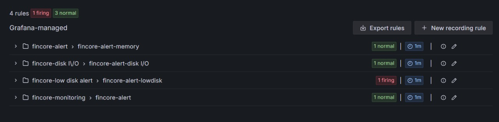
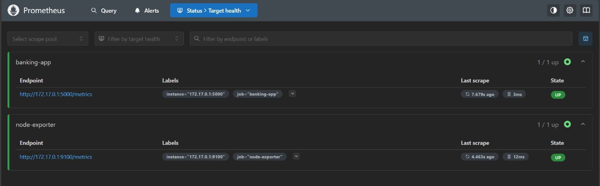
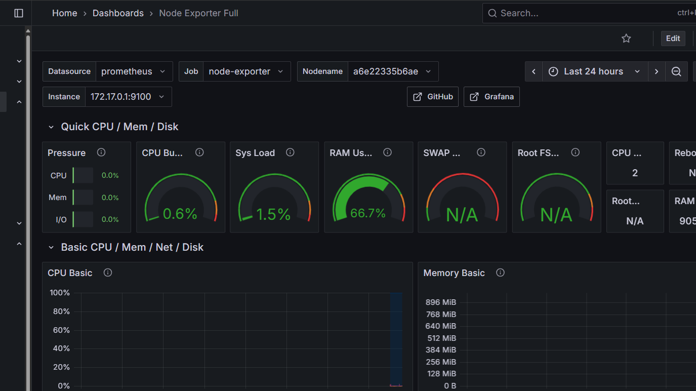
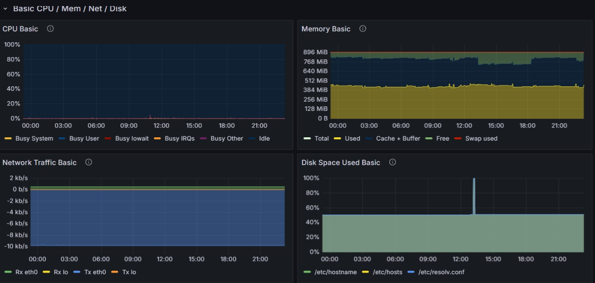
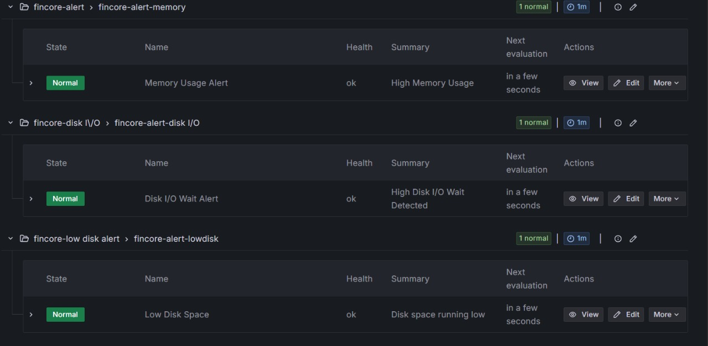

# [FinCore Banking Microservices Monitoring & Observability Project](https://github.com/darpan-cloud/fincore-project.git)


This project demonstrates an end-to-end **Monitoring & Observability system** for a Dockerized Flask-based **banking microservices** application using **Prometheus + Grafana**,and **Alertmanager**, hosted on **AWS EC2**.  It captures both custom application metrics exposed via **/metrics** and system-level metrics using **Node Exporter**, enabling real-time visibility, alerting, and dashboarding. Infrastructure resources are provisioned using **Terraform** for repeatable, automated deployment.

The Flask app simulates core banking services with microservice-style endpoints:

- /balance: Shows current balance.

- /transfer: Simulates a money transfer.

- /transactions: Lists recent transactions.

Metrics are collected using Prometheus client libraries.


## 📚 Table of Contents


- [Tech Stack](#tech-stack)
- [Project Status](#project-status)
- [Folder Structure](#folder-structure)
- [Provision with Terraform](#provision-with-terraform)
- [How to Clone and Run This Project Manually](#how-to-clone-and-run-this-project-manually)
- [Alerting](#alerting)
- [How to Simulate and Revert Alerts](#how-to-simulate-and-revert-alerts)
- [Screenshots](#screenshots-uploaded-via-scp)
- [Future Enhancement](#future-enhancements)


## Tech Stack

- 🐍 Language & Framework

    - Python (Flask)

- 📈 Monitoring & Observability

   - 🔭 Prometheus – Metrics scraping and storage

   - 📦 Node Exporter – Host-level system metrics

   - 📊 Grafana – Metrics dashboards and visualization

   - 🚨 Alertmanager – Alerting based on Prometheus rules

- 📦 Containerization

   - 🐳 Docker – Containerizing the Flask application

- ☁️ Cloud Infrastructure

   - 🌐 AWS EC2 – Hosting Prometheus, Grafana, and the app

   - ⚙️ Terraform – Automating EC2 provisioning

## Project Status
- ✅ Fully Working — Complete monitoring and observability setup

- ✅ Dockerized — Runs all services in Docker containers

- ✅ App + System Monitoring — Tracks both Flask metrics and system metrics via Node Exporter

- ✅ Visual Proof — Grafana & Prometheus screenshots included

- ✅ Easy to Replicate — Just clone the repo and follow the setup instructions

- ✅ Infrastructure as Code — AWS EC2 provisioning via Terraform


## Folder Structure

```bash
fincore-monitoring/                                          
  ├── app.py # Flask-based banking microservices app exposing /balance, /transfer, etc.                      
  ├── Dockerfile # Docker image for Flask app                 
  ├── prometheus.yml # Prometheus scrape config   
  ├── README.md  # Project documentation                
  ├── grafana/
  │   ├── grafana.ini                 # Grafana config file enabling SMTP and provisioning settings
  │   ├── dashboards/
  │   │   ├── fincore-alerts.json     # Grafana dashboard JSON for custom banking alert panels
  │   │   └── node-exporter-dashboard.json # Grafana dashboard JSON for node-exporter metrics
  │   └── provisioning/
  │       ├── alerting.yaml           # Main alerting provisioning entry to load contact points and alert rules
  │       ├── alerting/
  │       │   ├── contact-points.yml          # Defines contact points (e.g., email) for alert delivery
  │       │   ├── fincore-alerts.yml          # Defines actual alert rules and expressions
  │       │   └── notification-policies.yml   # Policies for how/when to notify contact points
  │       ├── dashboards/
  │       │   └── dashboards.yml      # Grafana dashboards provisioning file (maps folder and files)
  │       └── datasources/
  │           └── prometheus-datasource.yml # Grafana provisioning file for Prometheus data source
  ├── screenshots/     
  │     ├── grafana.png # Screenshot of Grafana 
  |     ├── Grafana2.png # Another dashboard view     
  │     ├──Prometheus-targets.png # Screenshot of Prometheus targets
  │     ├── Alert-firing.png            # Screenshot of triggered alert
  │     ├── Alerts.png                  # Screenshot showing alert rules in Grafana
  │     └── Simulating-alert.png        # Screenshot demonstrating simulated alert
  ├── terraform-fincore/
  │     ├── main.tf               # Terraform infrastructure config
  │     ├── output.tf             # Output values from Terraform
  │     ├── terraform.tfvars      # Environment-specific variable values
  │     └── variables.tf          # Declared Terraform variables

```

## Provision with Terraform
### Prerequisites
- Terraform Installed

- AWS credentials configured using aws configure

- SSH key pair (public & private)

If key pair not available use :
```
ssh-keygen -t rsa -b 4096 -f ~/.ssh/<keyname>
```

For Windows:
```
mkdir %USERPROFILE%\.ssh
ssh-keygen -t rsa -b 4096 -f %USERPROFILE%\.ssh\fincore-key
```


You can provision the entire infrastructure on AWS EC2 using [Terraform](https://www.terraform.io/). This includes:
- Launching EC2 instance
- Installing Docker
- Cloning this GitHub repo
- Running the Flask App, Prometheus, Grafana, and Node Exporter

### 📁 Terraform Directory Structure

- main.tf — for infrastructure definition

- variables.tf — to define variables like AMI ID, key path

- outputs.tf - To print instance IP after apply


- terraform.tfvars — your actual values (create inside terraform-fincore folder)

```hcl
aws_region      = "ap-south-1"
ami_id          = "ami-0d0ad8bb301edb745"  
key_name        = "fincore-key"
public_key_path = "/home/ec2-user/.ssh/fincore-key.pub"

#Update keyname and path as per your public key
```

### Deploy via Terraform

```bash
cd terraform-fincore    # Changes to terraform directory
# Create terraform.tfvars With proper key_paths
terraform init          # Initialize project
terraform plan          # Preview actions
terraform apply         # Create resources
```
Once it finishes, you’ll see the public IP of the new EC2 instance. You can then access:

Flask app: `http://<public-ip>:5000`

Prometheus: `http://<public-ip>:9090`

Grafana:  `http://<public-ip>:3000`


## How to Clone and Run This Project Manually
### 🔹 1. Clone the Repository

```bash
git clone https://github.com/darpan-cloud/fincore-project.git
cd fincore-project
```

### 🔹 2.  Launch EC2 Instance (Amazon Linux 2)
- Open ports in **Security Group**: `5000`, `9090`, `3000`, `9100`
- Download your `.pem` file for SSH access

### 🔹 3. SSH into EC2

```bash
ssh -i "path/to/your-key.pem" ec2-user@<EC2_PUBLIC_IP>
```


### 🔹 4. Install Docker (Amazon Linux 2)

```bash
sudo yum update -y
sudo amazon-linux-extras enable docker
sudo yum install docker -y
sudo service docker start
sudo usermod -aG docker ec2-user
exit
```

Then reconnect via SSH:

```bash
ssh -i "your-key.pem" ec2-user@<EC2_PUBLIC_IP>
```

### 🔹 5. Upload Project from Your Local PC

```bash
scp -i "path/to/your-key.pem" -r fincore-monitoring/ ec2-user@<EC2_PUBLIC_IP>:/home/ec2-user/
```


### 🔹 6. Build and Run Flask App

```bash
cd fincore-monitoring
docker build -t banking-app .
docker run -d -p 5000:5000 banking-app
```

Open in browser:
`http://<EC2_PUBLIC_IP>:5000/balance`


### 🔹 7. Start Prometheus

```bash
docker run -d -p 9090:9090 \
  -v $PWD/prometheus.yml:/etc/prometheus/prometheus.yml \
  prom/prometheus
```

- Check Prometheus Targets:
`http://<EC2_PUBLIC_IP>:9090/targets`

- Verify both Node-exporter and banking app should be UP

#### To Simulate Load using CLI use:
`curl http://<IP>:5000/balance`

`curl http://<IP>:5000/transfer`

`curl http://<IP>:5000/transactions`

### 🔹 8. Start Node Exporter

```bash
docker run -d -p 9100:9100 prom/node-exporter
```

### 🔹 9. Start Grafana

```bash
docker run -d -p 3000:3000 \
                -v $(pwd)/grafana/provisioning:/etc/grafana/provisioning \
                -v $(pwd)/grafana/dashboards:/var/lib/grafana/dashboards \
                -v $(pwd)/grafana/grafana.ini:/etc/grafana/grafana.ini \
                -v grafana-storage:/var/lib/grafana \
                grafana/grafana
```

- Access Grafana:
`http://<EC2_PUBLIC_IP>:3000`

- Login:

  - Username: admin

  - Password: admin


### 🔹 10. Import Grafana Dashboard
- Open Grafana in browser

- Go to Dashboards → Import

- Upload: Grafana/node-exporter-dashboard.json

- Select Prometheus as data source

- View live metrics


#### 🧪 How to Generate Metrics
Open the following repeatedly to simulate API load:

`http://<EC2_PUBLIC_IP>:5000/balance`


This updates metrics like:

- http_requests_total

- http_request_duration_seconds

- http_request_errors_total


#### 📈 Metrics Tracked
- Application Metrics

- Total HTTP requests

- Request durations

- Error count

- System Metrics (via Node Exporter)

- CPU usage

- Memory usage

- Disk and filesystem stats

### 🔹 11. Import Alerts

- Open Grafana at `http://<EC2-IP>:3000` and log in.

- Go to **Alerting → Alert rules → Import** 

-  Upload `Grafana/fincore-alerts.json`.

- Select the appropriate Prometheus data source.

- Save/import to recreate all four alert rules.

## Alerting

This project includes four active Grafana-managed alert rules. They are exported and stored in `Grafana/fincore-alerts.json`. Anyone cloning the repo can import them into Grafana to reproduce the same alerting behavior.

### Alert Rules Included

1. **High Memory Usage** (`fincore-alert-memory`)
   - **Purpose:** Detect when memory usage exceeds 80%.
   - **Query:** `100 * (1 - (node_memory_MemAvailable_bytes / node_memory_MemTotal_bytes))`
   - **Condition:** Average above 80% for 2 minutes.
   - **Labels:** `severity: warning`
   - **Summary:** High memory usage detected on instance.
   - **Description:** Memory usage is above threshold, consider investigating memory pressure.

2. **High Disk I/O Wait** (`fincore-alert-disk I/O`)
   - **Purpose:** Detect excessive CPU time waiting on disk I/O.
   - **Query:** `rate(node_cpu_seconds_total{mode="iowait"}[1m]) * 100`
   - **Condition:** Above 20% for 2 minutes.
   - **Labels:** `severity: warning`
   - **Summary:** High I/O wait detected.
   - **Description:** CPU is spending too much time waiting on disk operations.

3. **Low Disk Space** (`fincore-alert-lowdisk`)
   - **Purpose:** Alert when disk usage is high (>80%).
   - **Query:** `(node_filesystem_size_bytes{fstype!~"tmpfs|overlay"} - node_filesystem_free_bytes{fstype!~"tmpfs|overlay"}) / node_filesystem_size_bytes{fstype!~"tmpfs|overlay"} * 100`
   - **Condition:** Above 80% usage for 2 minutes.
   - **Labels:** `severity: warning`
   - **Summary:** Disk space running low.
   - **Description:** Available disk space below acceptable threshold.

4. **General Monitoring Health** (`fincore-alert`)
   - **Purpose:** Ensure that all key monitoring targets (application, system metrics) are up and being scraped correctly.
   - **Query/Condition:** Checks for missing or down Prometheus targets.
   - **Labels:** `severity: normal`
   - **Summary:** One or more monitoring targets are unavailable.
   - **Description:** This alert fires if any expected service (e.g., Node Exporter or Flask app) is down or not exposing metrics. It serves as a catch-all for missing metrics and general system monitoring health.


### How to Simulate and Revert Alerts
You can manually trigger and then revert the alert conditions to test your Grafana alert rules.

#### 🔺 1. High Memory Usage (fincore-alert-memory)

**Simulate:**

```bash
sudo yum install -y stress
stress --vm 1 --vm-bytes 512M --timeout 30s
```

This allocates 512MB of memory for 30 seconds.

**Revert:**
No action needed — memory is released automatically after 30 seconds.

#### 🔺 2. High Disk I/O Wait (fincore-alert-disk I/O)

**Simulate:**

```bash
dd if=/dev/zero of=testfile bs=10M count=500
```

This writes 5GB to disk, causing disk I/O pressure.

**Revert:**

```bash
rm testfile
```
Deletes the file and stops disk activity.

#### 🔺 3. Low Disk Space (fincore-alert-lowdisk)

**Simulate:**

```bash
dd if=/dev/zero of=bigfile bs=100M count=100
```
Creates a 10GB dummy file to reduce available disk space.

- Triggered Alert : 

**Revert:**

```bash
rm bigfile
```
Removes the file to free up space and reset the alert.

#### 🔺 4. General Monitoring Health (fincore-alert)

**Simulate (stop Node Exporter):**

```bash
docker stop $(docker ps -q --filter ancestor=prom/node-exporter)
```
Stops Node Exporter, simulating a failed or unreachable monitoring service.

**Revert (restart Node Exporter):**

```bash
docker run -d -p 9100:9100 prom/node-exporter
```
Restarts Node Exporter to restore monitoring.

## Screenshots (Uploaded via SCP)


### Prometheus targets page (Prometheus-targets.png)



---

### Grafana dashboard (Grafana.png)




---

### Alerts (Alerts.png)


---


## Future Enhancements

- Use Docker Compose for easier deployment

- Automated Setup Scripts (Shell/Terraform modules) for reproducible provisioning

- Add real-time transaction processing alerts

- Separate microservices for each banking endpoint

- Add API load testing (e.g. for /transfer spikes)

---

**[Return to Top](#fincore-banking-microservices-monitoring--observability-project)**


